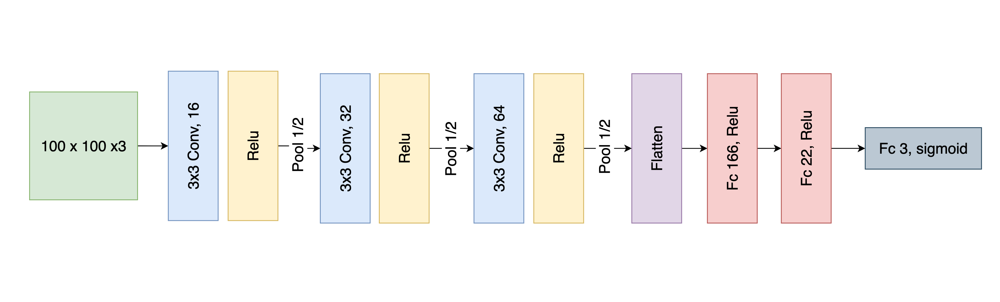

# 树莓派口罩规范佩戴检测


### 说明：项目提供的模型基于互联网收集的图片训练（每类2000张，共6000张），样本及场景过少，实际测试中发现对光线较敏感，`不规范`这一类误识别率较高，仅做教学使用，建议大家自行训练再使用，欢迎交流！

#### 本项目使用的LeNet-5模型架构：




## 一、硬件：

* PC端运行：Windows10或11（无需GPU，有最好）或MacOS 都测试可行
* 树莓派运行：树莓派 4B model B 8G 版
* USB RGB 摄像头

## 二、软件：

* Python==3.8
* 电脑需要：TensorFlow，树莓派需要：TensorFlow lite
* opencv 
* pixellib

## 三、用法：

### 3.1、电脑运行

* [下载模型](https://github.com/enpeizhao/CVprojects/releases/tag/Models)`face_mask_model.h5`，放到`data目录下`；
* [下载模型](https://github.com/enpeizhao/CVprojects/releases/tag/Models)`res10_300x300_ssd_iter_140000.caffemodel`，放到`weights`目录下；
* 运行下列代码

```
python demo.py
```

### 3.2、树莓派运行

* 进入`rasp_lite`文件夹；
* [下载模型](https://github.com/enpeizhao/CVprojects/releases/tag/Models)`res10_300x300_ssd_iter_140000.caffemodel`，放到`rasp_lite/weights`目录下；
* [下载模型](https://github.com/enpeizhao/CVprojects/releases/tag/Models)`face_esmask_model.tflite`，放到`rasp_lite/data`目录下；
* 运行下列代码

```
python rasp_fast.py
```

### 3.3、自己训练模型

* 采集照片：放到`images`文件夹下，`1.yes、2.no、3.nose`分别代表`正常佩戴、未佩戴、漏出鼻子`
* 数据预处理：运行`1.images_preprocess.ipynb`将图片数据预处理为`numpy`文件，存在`data`目录下；
* 训练模型：运行`2.model_train.ipynb`训练模型，模型文件在`data`目录下；
* 压缩模型：运行`4.tflite.ipynb`压缩模型，压缩后的模型在`data`目录下，需要手动搬到树莓派`rasp_lite/data`目录下；


### 微信技术交流、问题反馈：


