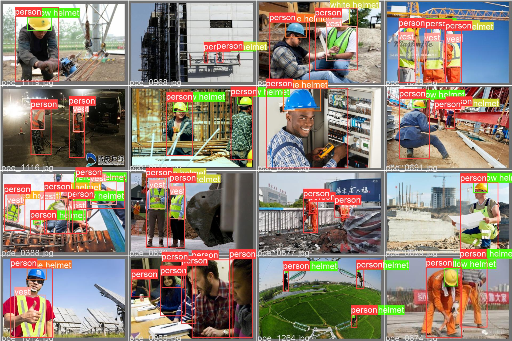
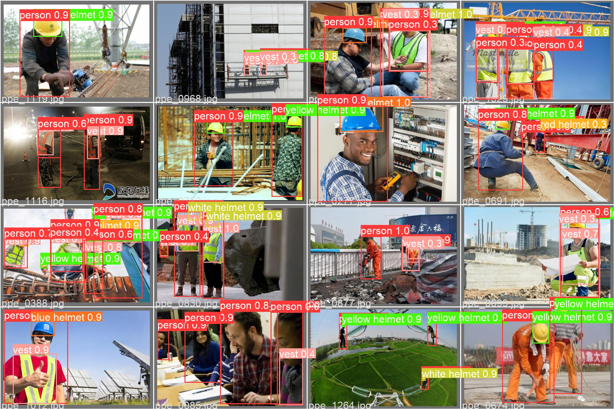

# YOLOv5 jetson nano 工地防护检测


> 本项目是本人授课使用，请仅做个人学习、研究使用。


## 一、硬件：

* PC端运行：Windows10或11（无需GPU，有最好）或MacOS 都测试可行；
* USB RGB 摄像头；
* jetson nano（可选）。

## 二、软件：

* Python==3.8
* Pytorch 
* YOLOv5
* opencv 

## 三、用法：

* 参考[YOLOv5官网](https://github.com/ultralytics/yolov5)，将YOLOv5 clone到本项目目录（当前YOLOv5目录为空，替换即可）；
* 下载训练好的权重文件，如`ppe_yolo_n.pt`放到`weights`目录下：[下载地址](https://github.com/enpeizhao/CVprojects/releases/tag/Models)
* 运行`python demo.py`即可；
* jetson nano tensoRT加速运行使用`python yolo_trt_demo.py`，可以跑到20FPS，具体参考https://github.com/wang-xinyu/tensorrtx/tree/master/yolov5
* Deepstream 参考NVIDIA deep stream SDK描述运行，对应目录：`DeepStream6.0_Yolov5-6.0`；


## 四、模型相关：

* Ground truths



* 预测




* 共训练了YOLOv5 n、m、s、n6四个模型：


各个模型评估数据如下：

```shell
# n
# python val.py --data ./data/coco_chv.yaml  --weights runs/train/base_n/weights/best.pt --batch-size 12
# 4.3 GFLOPs
		Class     Images     Labels          P          R     mAP@.5 mAP@.5:.95
                 all        133       1084       0.88      0.823      0.868      0.479
              person        133        450      0.899      0.808      0.877      0.484
                vest        133        217      0.905      0.788      0.833      0.468
         blue helmet        133         44      0.811       0.75      0.803      0.489
          red helmet        133         50      0.865        0.9      0.898      0.425
        white helmet        133        176      0.877      0.807      0.883      0.467
       yellow helmet        133        147      0.922      0.885      0.917      0.543
Speed: 0.2ms pre-process, 4.7ms inference, 3.9ms NMS per image at shape (12, 3, 640, 640)
    

# s
# python val.py --data ./data/coco_chv.yaml  --weights runs/train/base_s/weights/best.pt --batch-size 12
# 15.8 GFLOPs

		Class     Images     Labels          P          R     mAP@.5 mAP@.5:.95
                 all        133       1084      0.894      0.848      0.883      0.496
              person        133        450      0.915       0.84      0.887      0.508
                vest        133        217      0.928      0.834      0.877      0.501
         blue helmet        133         44      0.831       0.75      0.791      0.428
          red helmet        133         50        0.9      0.899      0.901      0.473
        white helmet        133        176      0.884      0.858       0.91      0.496
       yellow helmet        133        147      0.908      0.905       0.93      0.567
Speed: 0.2ms pre-process, 8.3ms inference, 3.9ms NMS per image at shape (12, 3, 640, 640)


# m
# python val.py --data ./data/coco_chv.yaml  --weights runs/train/base_m/weights/best.pt --batch-size 12
# 48.0 GFLOPs
		Class     Images     Labels          P          R     mAP@.5 mAP@.5:.95
                 all        133       1084      0.928      0.845      0.886      0.512
              person        133        450      0.935      0.794      0.895      0.529
                vest        133        217      0.922      0.813      0.868      0.508
         blue helmet        133         44      0.916      0.818      0.812      0.464
          red helmet        133         50        0.9        0.9      0.892      0.488
        white helmet        133        176      0.932      0.841      0.899      0.511
       yellow helmet        133        147      0.964      0.905      0.948      0.574
Speed: 0.4ms pre-process, 18.8ms inference, 4.6ms NMS per image at shape (12, 3, 640, 640)


# n6 1280 ：
# python val.py --data ./data/coco_chv.yaml  --weights runs/train/base_n6_1280/weights/best.pt --batch-size 12 --img-size 1280
# 4.3 GFLOPs
		Class     Images     Labels          P          R     mAP@.5 mAP@.5:.95
                 all        133       1084      0.906      0.858      0.901      0.507
              person        133        450      0.903      0.831      0.887      0.503
                vest        133        217      0.922      0.816       0.86      0.486
         blue helmet        133         44      0.843      0.795      0.828      0.465
          red helmet        133         50      0.899       0.92      0.954      0.507
        white helmet        133        176      0.921      0.865      0.925      0.515
       yellow helmet        133        147      0.947      0.918      0.954      0.566
Speed: 1.5ms pre-process, 14.1ms inference, 2.2ms NMS per image at shape (12, 3, 1280, 1280)
   
```


### 微信技术交流、问题反馈：


