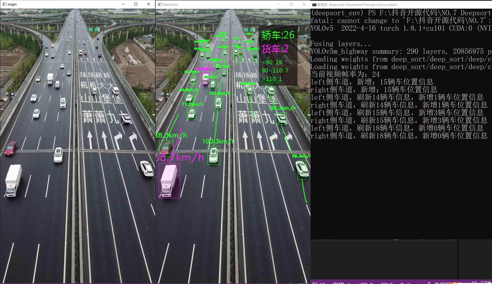

# YOLOv5 + Deepsort 车辆追踪及速度分析

> 本项目是本人授课使用，请仅做个人学习、研究使用。

## 一、硬件：

* PC端运行：Windows10或11（最好有GPU）
* MACOS（可能比较卡）

## 二、软件：

* Pytorch 
* YOLOv5
* opencv 

## 三、用法：

* 安装第三方包：`pip install -r requirements.txt`

* 下载相关文件：[下载地址](https://github.com/enpeizhao/CVprojects/releases)

  * 下载训练好的权重文件`highway_m_300.pt`和`highway_reid.pt`放到`weights`目录下；
  * 下载字体`MSYH.ttc`至`fonts`目录下；
  * 下载媒体文件`highway.mp4`至`videos`目录下（该视频是本人无人机拍摄，禁止他用）

* 运行`python demo.py`即可。

  

## 四、参考资料

* https://github.com/ZQPei/deep_sort_pytorch
* https://github.com/Sharpiless/Yolov5-deepsort-inference
* https://github.com/dyh/unbox_yolov5_deepsort_counting
* https://github.com/mikel-brostrom/Yolov5_DeepSort_Pytorch

### 微信技术交流、问题反馈：

