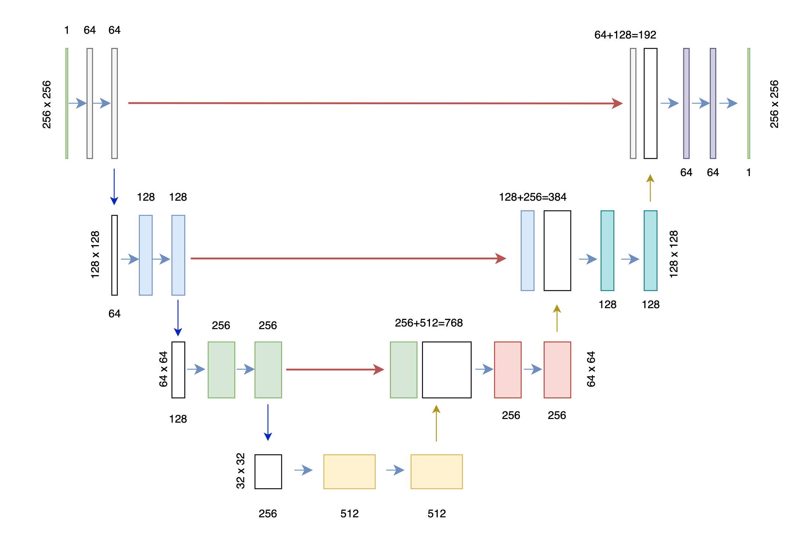

# UNet医学图像分割

## 说明：

* 本项目是本人为UNet授课做的应用演示
* 本项目用的UNet网络架构

## 一、硬件：

* Windows GPU

## 二、软件环境安装：

* pytorch
* Nibabel

## 三、用法：

* 医学数据较敏感，请自行下载。
* 数据预处理：1.img_preprocess.ipynb
* 制作数据集：2.custom_dataset.ipynb
* 训练模型：4.model_train_bce.ipynb
* 测试模型：5.model_test_bce.ipynb

### 微信技术交流、问题反馈：

