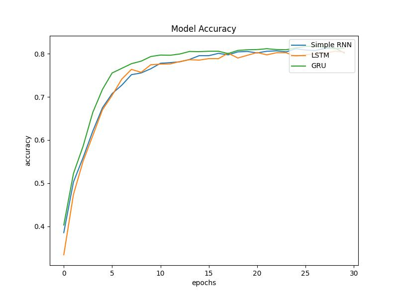

# 29.CNN-RNN/VIT视频动作分类

## 说明：

* 本项目是本人为RNN（SimpleRNN、LSTM、GRU）、transformer, 视频动作分类 授课做的应用演示
* 原理示意：

## 一、硬件：

* Windows GPU

## 二、软件环境安装：

* tensorflow-gpu==2.5.0

## 三、用法：

* 数据使用的是`ucf101`，挑选了50个动作，训练集5000个视频，测试集2000个；
* 了解RNN使用Demo：`RNN原理`文件夹下IMDB电影评论分类Demo notebook；
* CNN-RNN视频动作分类：
  * 数据预处理、模型训练：`video_rnn_inception.ipynb`
  * 模型测试：`video_rnn_test.ipynb`

* CNN-VIT视频动作分类：
  * 数据预处理、模型训练：`video_transformer.ipynb`
  * 模型测试：`video_trans_test.ipynb`

## 四、其他信息

* CNN -  SimpleRNN/LSTM/GRU测试准确率

其中GRU最高准准确率为83%

* CNN-VIT最高准确率为85.4%，混淆矩阵：

### 微信技术交流、问题反馈：

